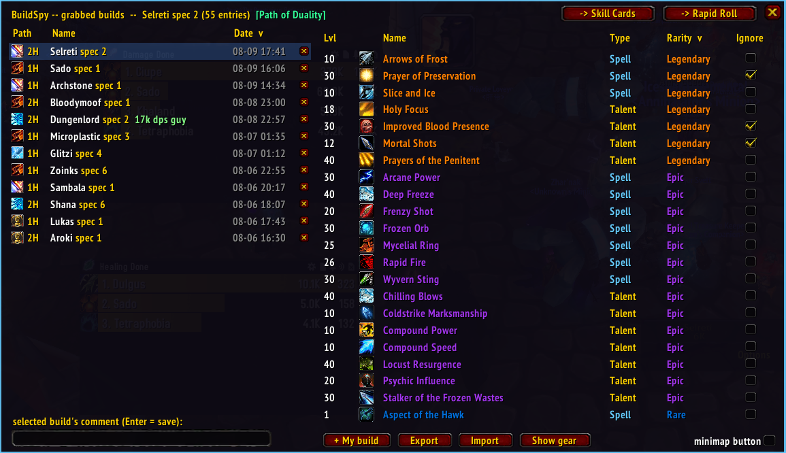
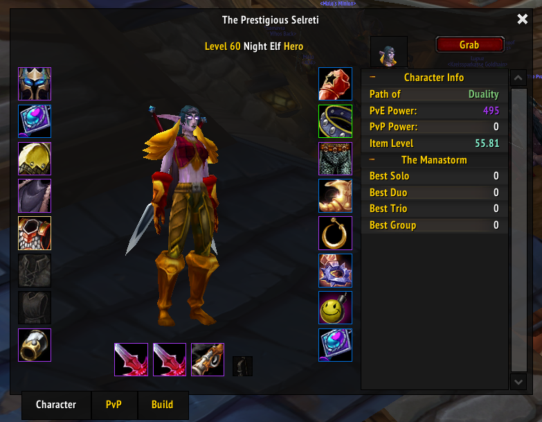
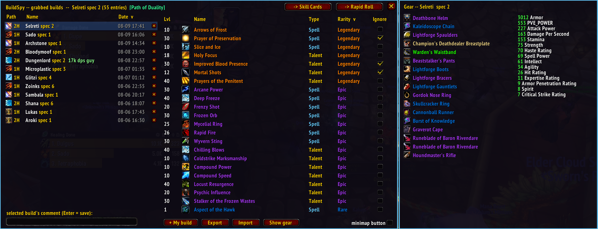
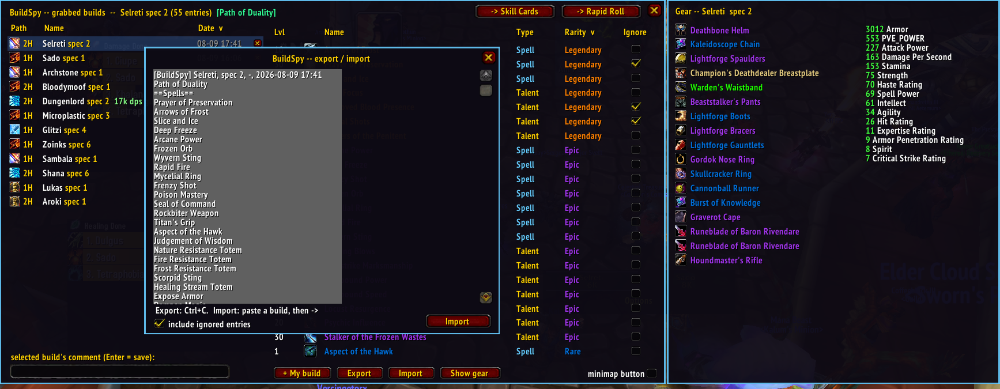
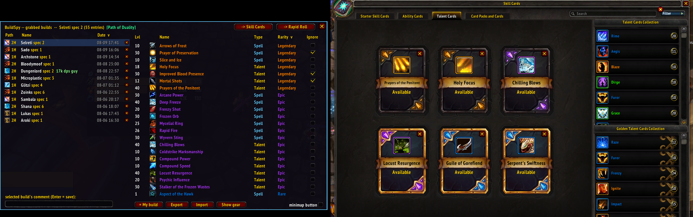
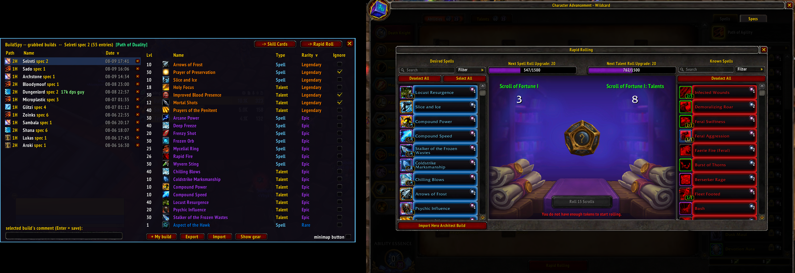

# BuildSpy

Spy, save and reproduce other players' builds on **Project Ascension**
(Wildcard / Character Advancement realms). See a build you like? Grab it,
study it, share it — and rebuild it on your own character in two clicks.

## Grab any player's build

A **Grab** button sits right on the inspection window (`/ains` on your target
does the same). One click captures the player's full Character Advancement
build — spells, talents and their chosen **Path** — plus their equipped gear
and identity, into your local database.

**+ My build** (bottom of the builds window) or `/ains self` grabs your own
character, Path included.

## Browse everything

`/ains builds` — or the minimap button — opens the main window:

- **Left**: every grabbed build with its Path icon, 1H/2H, name, spec,
  comment and date. Sortable by Name, Date or Path; hover a row for the full
  detail; add a comment per build.
- **Right**: the build's spells and talents — required level, type, and
  **rarity read from the actual Skill Cards** (uncollected ones included).
  Default sort: rarity, legendary first. The **Ignore** checkbox excludes an
  entry from every export below.

## Gear & stats

**Show gear** slides out a side pane: the real equipped items (tooltips show
enchants) and the summed stats of the whole set.

## Share builds as plain text

**Export** produces a paste-anywhere text version of the build — header,
Path, spells and talents sorted by rarity then level, and the gear as exact
`itemID:enchantID` pairs. **Import** reads one back, unknown names reported.
A toggle chooses whether ignored entries ship too.

**Link** copies a shareable `ascension.nie.one` build link (base-36 spell
ids) — paste it in guild chat or a browser and the build opens on the site.

Import accepts **three formats**: a BuildSpy text export, an
`ascension.nie.one` link, or the site's comma-separated spell-id list — any
of them lands as a build in your list.

### Import from the Darkmoon Logs armory

WoW 3.3.5 addons can't fetch web pages, so BuildSpy can't read an armory URL
from inside the game. A small **browser bookmarklet** bridges the gap: open a
character's page on `darkmoon.ascensionlogs.gg/armory/NAME`, click the
bookmarklet, and it copies a BuildSpy text export to your clipboard — paste it
into **Import**.

Setup (once): create a new browser bookmark and paste the contents of
[`tools/armory-bookmarklet.txt`](tools/armory-bookmarklet.txt) as its URL.

Use it: on **any** page of `darkmoon.ascensionlogs.gg`, click the bookmark. It
asks for a **player name or armory URL** — type one and it copies the build to
your clipboard. Switch to the game → **Import** → Ctrl+V → Import. The build
(spells, talents, path and gear) appears under that character's name.

Notes:
- The armory blocks cross-site requests, so the bookmark only works while
  you're on `darkmoon.ascensionlogs.gg` (any page — the prompt does the rest).
- If your bookmarks bar is hidden while browsing, **Ctrl+Shift+B** toggles it
  (Chrome/Edge/Firefox), or open the bookmark from the bookmarks menu.
- Readable source: [`tools/armory-bookmarklet.js`](tools/armory-bookmarklet.js).

## Reproduce builds

- **→ Skill Cards** — optimizes and **places your Skill Cards** for the
  selected build: golden pools first, rarest cards first, starters = the
  build's level-1 spells, never a duplicate, verified slot by slot.

- **→ Rapid Roll** — pushes the build into Rapid Rolling's **Desired
  Spells** list (verified entry by entry) and marks everything you already
  know that is NOT in the build as undesired, ready to reroll.

Both buttons open the matching client window first, and the addon reminds
you in chat to double-check the result yourself.

- **→ Auto-Roll** — if you also run the [AscensionAutoRoll] addon, this sends
  the build straight to it: opens its window, pastes the build link and runs
  its Analyze. You still press **Start** there yourself. (The button is greyed
  out when AscensionAutoRoll isn't installed.)

The **Accelerated Roll** toggle (bottom-right of the window) skips the
Wildcard dice reveal animation, so a rolled spell appears instantly.

[AscensionAutoRoll]: https://www.curseforge.com/wow/addons

## Commands

| Command | Effect |
| --- | --- |
| `/ains` | Grab the inspected/targeted player |
| `/ains builds` | Toggle the builds window |
| `/ains self` | Grab your own build |
| `/ains list` | Chat summary of the database |
| `/ains clear` | Purge all captures |

## Installation

1. Download the latest version (Code → Download ZIP).
2. Extract the `BuildSpy` folder into `Interface\AddOns\` so you end up with
   `Interface\AddOns\BuildSpy\BuildSpy.toc`.
3. Restart the game client (a full restart, not a `/reload`).

No dependencies — works standalone. A draggable minimap button toggles the
builds window (the *minimap button* checkbox in the window hides it).

## License

[MIT](LICENSE)
